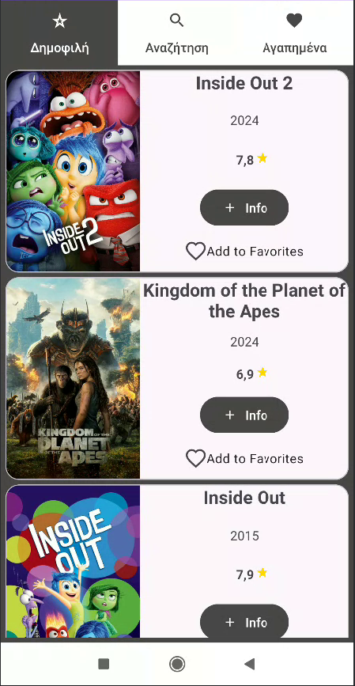
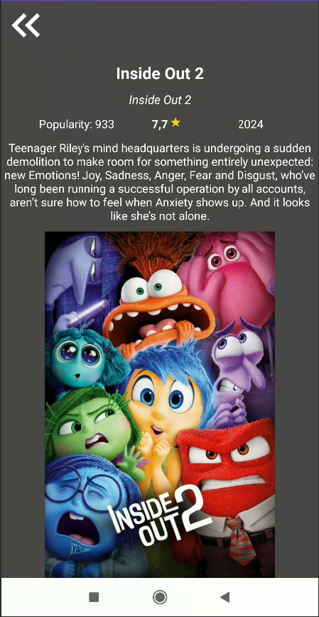
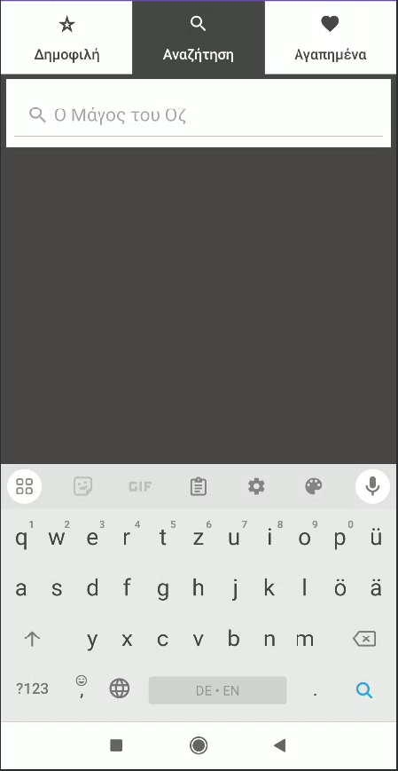
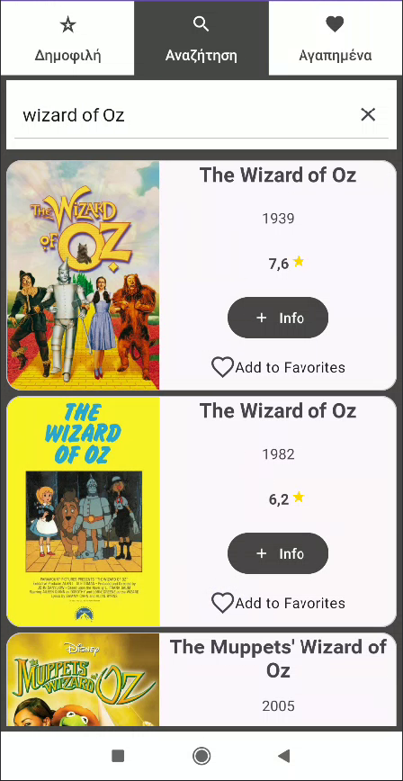
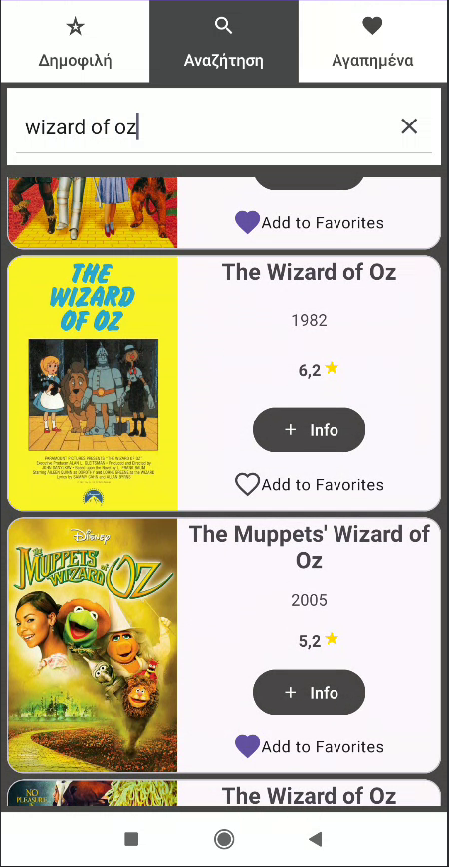
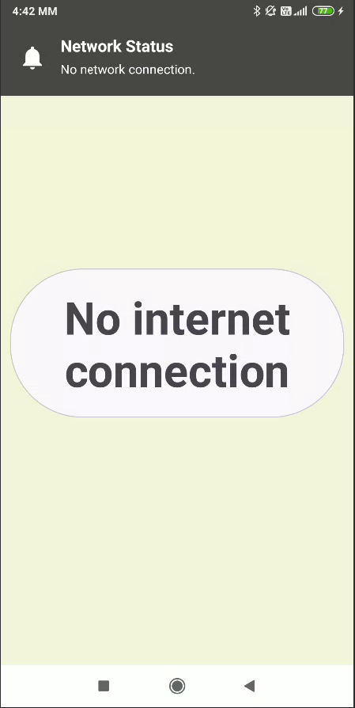

# MovieNight!

## Περιγραφή
Η android εφαρμογή MovieNight! παρουσιάζει δεδομένα που λαμβάνει από τη TMDb (The Movie Database) με έναν όμορφο και ευχάριστο τρόπο. Ο κάθε χρήστης μπορεί να δει τις πιο δημοφιλείς ταινίες, να αναζητήσει τη βάση δεδομένων για μια συγκεκριμένη ταινία, να δει πιο αναλυτικές πληροφορίες για κάθε ταινία της επιλογής του, καθώς και να προσθέσει μια ταινία στη λίστα με τα "favorites", δηλαδή τη λίστα με τις αγαπημένες του ταινίες.

## Απαιτήσεις Συστήματος
Android
- `minSdk = 24`
- `targetSdk = 34`

## Libraries που χρησιμοποιήθηκαν
- **Picasso**: Χρησιμοποιείται για τη φόρτωση και εμφάνιση εικόνων.
- **Ktor**: Χρησιμοποιείται για δικτυακές κλήσεις.
- **Gson**: Χρησιμοποιείται για την ανάλυση JSON δεδομένων.
- **LiveData**: Χρησιμοποιείται για τη διαχείριση και παρατήρηση των δεδομένων.
- **Tapadoo**: Χρησιμοποιείται για την εμφάνιση μηνυμάτων επιτυχίας και σφαλμάτων.
- **Material**: Χρησιμοποιείται για την παροχή υλικών στοιχείων σχεδιασμού.

## Χρήση

Το main screen της εφαρμογής μας είναι το popular tab του viewpager, εμφανίζει τις 40 πιο δημοφιλείς ταινίες ανάλογα με το TMDb.

Οπου και να ειμαστε αμα πατησουμε το κουμπι info θα μεταφερθουμε στην Info οθονη οπου και θα μαθουμε μερικες πιο αναλυτικες λεπτομεριες για τη ταινι.
Οταν θελουμε να επιστρεψουμε, παταμε το κουμπι πανω αριστερα και επιστρεφουμε στη Popular οθονη

Το search tab μας επιτρέπει να αναζητήσουμε στο TMDb οποιαδήποτε ταινία θέλουμε ανάλογα με τον τίτλο της. Υπάρχει και ενσωματωμένος έλεγχος για duplicate τίτλους (θα εμφανίζονται δηλαδή ταινίες με ίδιους τίτλους) αλλά και έλεγχος για το αν η λέξη που επιλέξαμε εμπεριέχεται στον τίτλο μιας ταινίας. Πχ άμα το query είναι "wizard" και εμείς θέλουμε τη ταινία "The Wizard of Oz".

Με ένα tap στο search view ανοίγει το πληκτρολόγιο.*

Αφού πληκτρολογήσουμε το όνομα της ταινίας που θέλουμε, εμφανίζονται όλες οι ταινίες που πληρούν τις προϋποθέσεις του search query.

Τόσο στο search όσο και στο popular και στο favorites fragment, μπορεί ο χρήστης να πατήσει την καρδιά για να βάλει μια ταινία στη λίστα με τα αγαπημένα του (favorites).*

Αν σε οποιαδήποτε στιγμή κατά το runtime της εφαρμογής χαθεί η σύνδεση στο ίντερνετ, μεταφερόμαστε σε αυτή την οθόνη με σχετική ενημέρωση.

Πατώντας πάνω στην ειδοποίηση μεταφερόμαστε στο wifi μας έτσι ώστε να δούμε τι δεν πήγε καλά με το ίντερνετ μας.

## Συγγραφείς - Συνεισφορά
- **Αντωνόπουλος Κωνσταντίνος**
- **Σπύρος**
